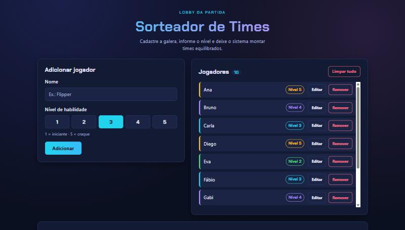
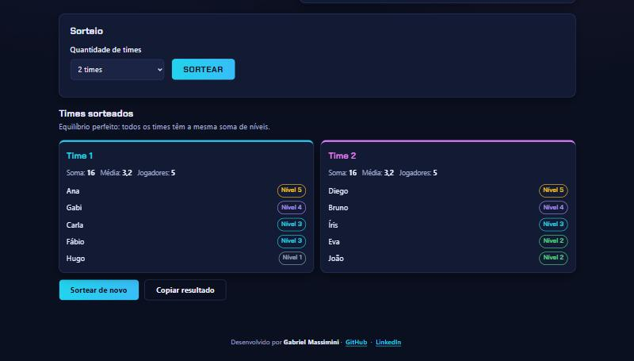
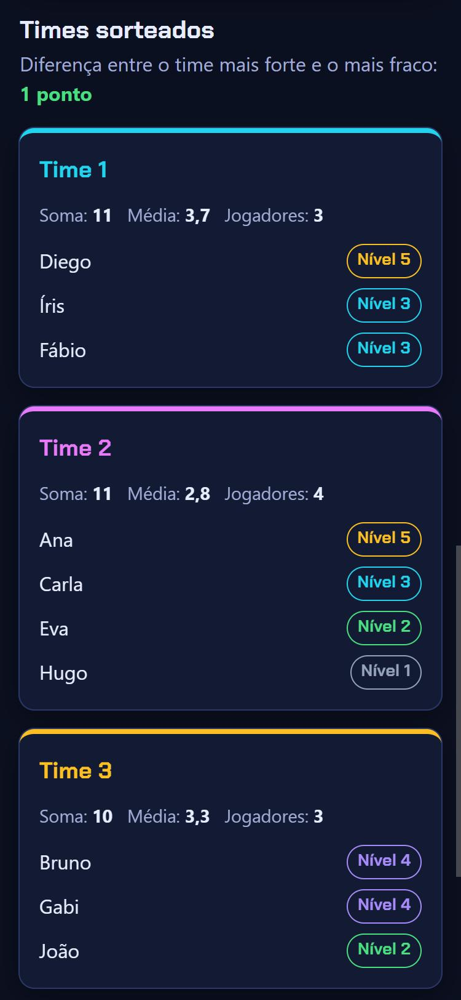

# Sorteador de Times

Sabe aquela discussão antes da partida com os amigos para decidir quem joga com quem? Criei este site para resolver isso. Você cadastra os jogadores, dá um nível de habilidade de 1 a 5 para cada um, escolhe quantos times quer e o sistema monta times com força parecida.

**Acesse:** https://gabrielmassimini.github.io/sorteador-de-times/



## Funcionalidades

- Cadastrar, editar e remover jogadores, cada um com nome e nível de 1 a 5
- Validações com mensagens na própria tela: nome obrigatório, sem nomes repetidos (mesmo com maiúsculas e minúsculas diferentes) e número mínimo de jogadores para sortear
- Escolher de 2 a 4 times
- Sortear times com o mesmo número de jogadores (ou diferença de no máximo 1) e soma de níveis o mais parecida possível
- Ver, para cada time, os jogadores, a soma e a média de nível, além da diferença entre o time mais forte e o mais fraco
- "Sortear de novo" para gerar outra combinação equilibrada
- "Copiar resultado" para colar os times formatados no WhatsApp ou no Discord
- A lista fica salva no navegador, então não se perde ao recarregar a página
- Botão para limpar tudo, com confirmação
- Funciona no celular e no computador, e dá para usar só com o teclado



## Como o sorteio funciona

A ideia é simples de explicar:

1. Ordeno os jogadores do nível mais alto para o mais baixo. Quem tem o mesmo nível é embaralhado, e é isso que faz o "Sortear de novo" gerar combinações diferentes.
2. Um por um, cada jogador vai para o time com a **menor soma de níveis** que ainda tem vaga.

Assim os jogadores mais fortes se espalham primeiro, e os mais fracos vão completando os times que ficaram para trás.

Por exemplo, com 10 jogadores em 3 times, os tamanhos ficam 4, 3 e 3. A vaga extra não pertence a nenhum time fixo: vai para o time que precisar dela para equilibrar a soma.

Esse tipo de algoritmo é chamado de **guloso**, porque em cada passo ele faz a melhor escolha do momento. Ele não garante sempre a divisão perfeita, mas chega muito perto. Comparei com a melhor divisão possível (testando todas as combinações) em 400 cenários aleatórios: ele encontrou a melhor em 373, e nos outros errou por no máximo 2 pontos.

## No celular



O resultado copiado fica assim:

```
🎮 *Times sorteados*

*Time 1* (soma 11 · média 3,7)
- Diego (5)
- Íris (3)
- Fábio (3)

*Time 2* (soma 11 · média 2,8)
- Ana (5)
- Carla (3)
- Eva (2)
- Hugo (1)

*Time 3* (soma 10 · média 3,3)
- Bruno (4)
- Gabi (4)
- João (2)

Diferença entre o time mais forte e o mais fraco: 1
```

## Tecnologias

- HTML semântico
- CSS puro, com variáveis, Flexbox, Grid e media queries
- JavaScript puro, sem bibliotecas
- localStorage para salvar a lista de jogadores

## Algumas decisões do projeto

- **Lógica separada da tela.** As funções do sorteio só recebem dados e devolvem dados, sem mexer no HTML. Isso deixa o código mais organizado e vai facilitar os testes automatizados.
- **Aleatoriedade "injetável".** A função de sorteio recebe a função que gera números aleatórios como parâmetro. No site ela usa o `Math.random`, e nos testes vou poder passar uma versão previsível.
- **Segurança.** O nome digitado entra na página com `textContent`, e não com `innerHTML`. Se alguém cadastrar um código HTML como nome, ele aparece como texto em vez de ser executado.
- **Acessibilidade.** Campos com `label`, erros anunciados para leitores de tela, foco visível na navegação por teclado e uma janela de confirmação que fecha com Esc.

## Como rodar

Não precisa instalar nada. Clone o repositório:

```bash
git clone https://github.com/GabrielMassimini/sorteador-de-times.git
```

Depois abra o `index.html` no navegador, ou use o Live Server do VS Code.

## O que aprendi

- Separar a lógica do programa do código que atualiza a tela
- Pensar em um algoritmo, testar em vários cenários e melhorar a partir do que os testes mostram. Na primeira versão, a vaga extra sempre ia para o Time 1, e isso deixava os times menos equilibrados.
- Salvar dados no navegador com localStorage e tratar o caso de os dados estarem corrompidos
- Validar formulários mostrando os erros na própria página, sem `alert()`
- Deixar um site acessível: labels, foco visível, uso por teclado e contraste
- Montar um layout responsivo "mobile first" com Flexbox e Grid
- Usar Git com commits pequenos e publicar o site no GitHub Pages

Desenvolvi o projeto usando o Claude (IA) como mentor de programação. Discutimos o planejamento, as decisões e o código, e fiz questão de entender cada parte antes de avançar para a próxima etapa.

## Próximos passos

O projeto está sendo construído em etapas:

- [x] **Etapa 1:** HTML, CSS e JavaScript puro
- [ ] **Etapa 2:** migrar para TypeScript e Tailwind CSS, usando o Vite
- [ ] **Etapa 3:** testes automatizados com Vitest para a lógica do sorteio

## Contato

Gabriel Massimini · [GitHub](https://github.com/GabrielMassimini) · [LinkedIn](https://www.linkedin.com/in/gabriel-massimini-junqueira/)
